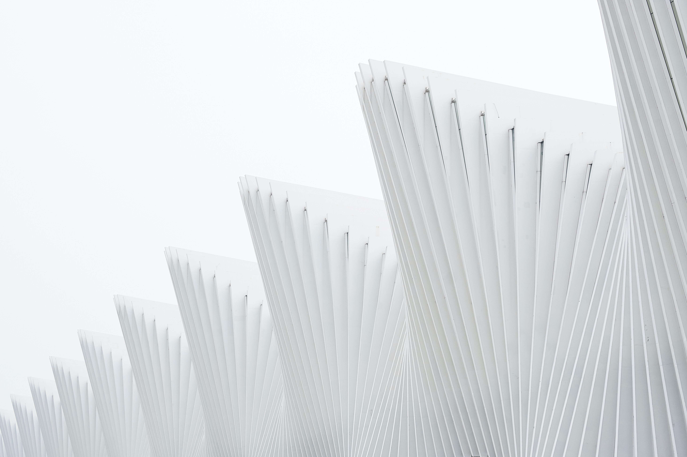

<html>
<head>
<link rel="shortcut icon" href="img/favicon.ico">
<link href='https://fonts.googleapis.com/css?family=Aldrich' rel='stylesheet'>

<title>
88Sites
</title>
</head>
<body>

    88Sites

</html>
